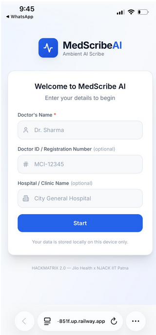
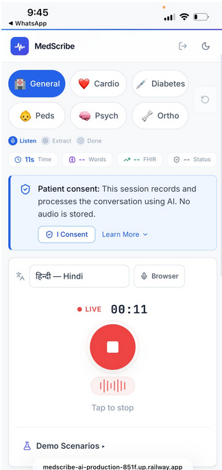
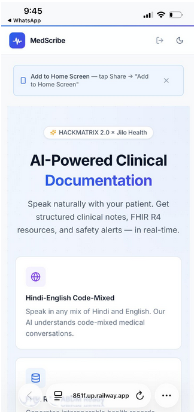
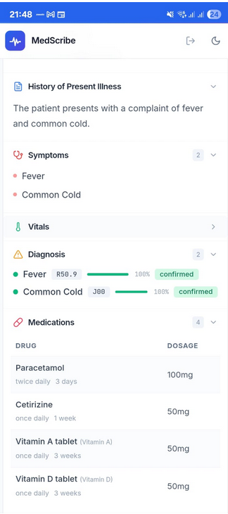
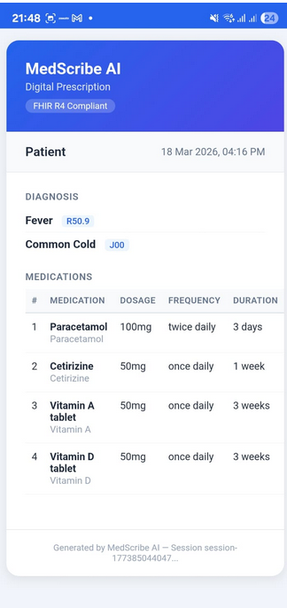
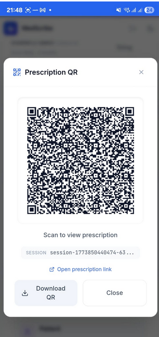
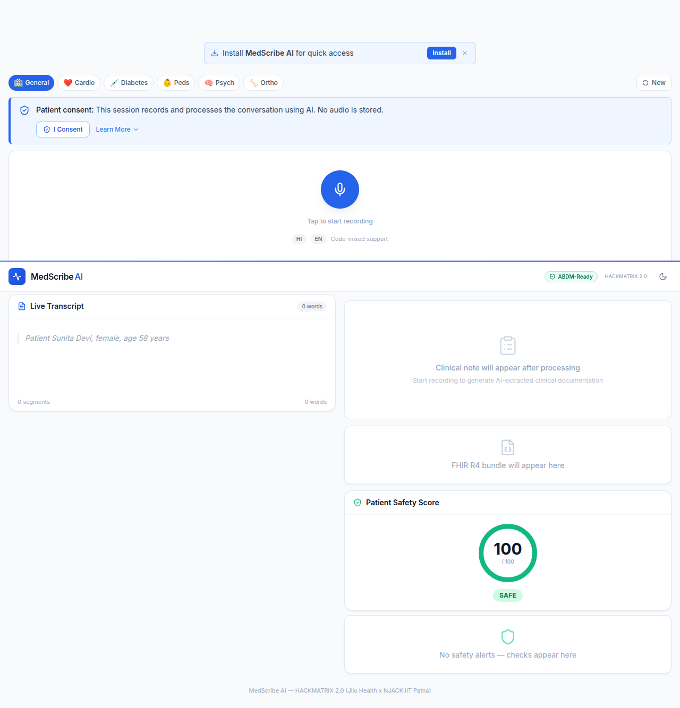
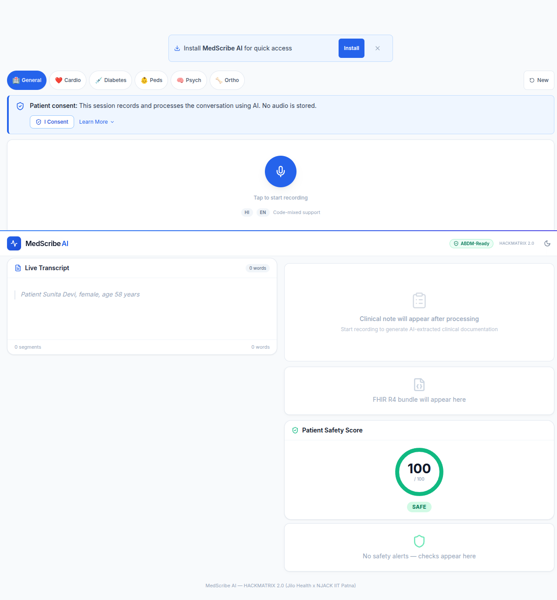
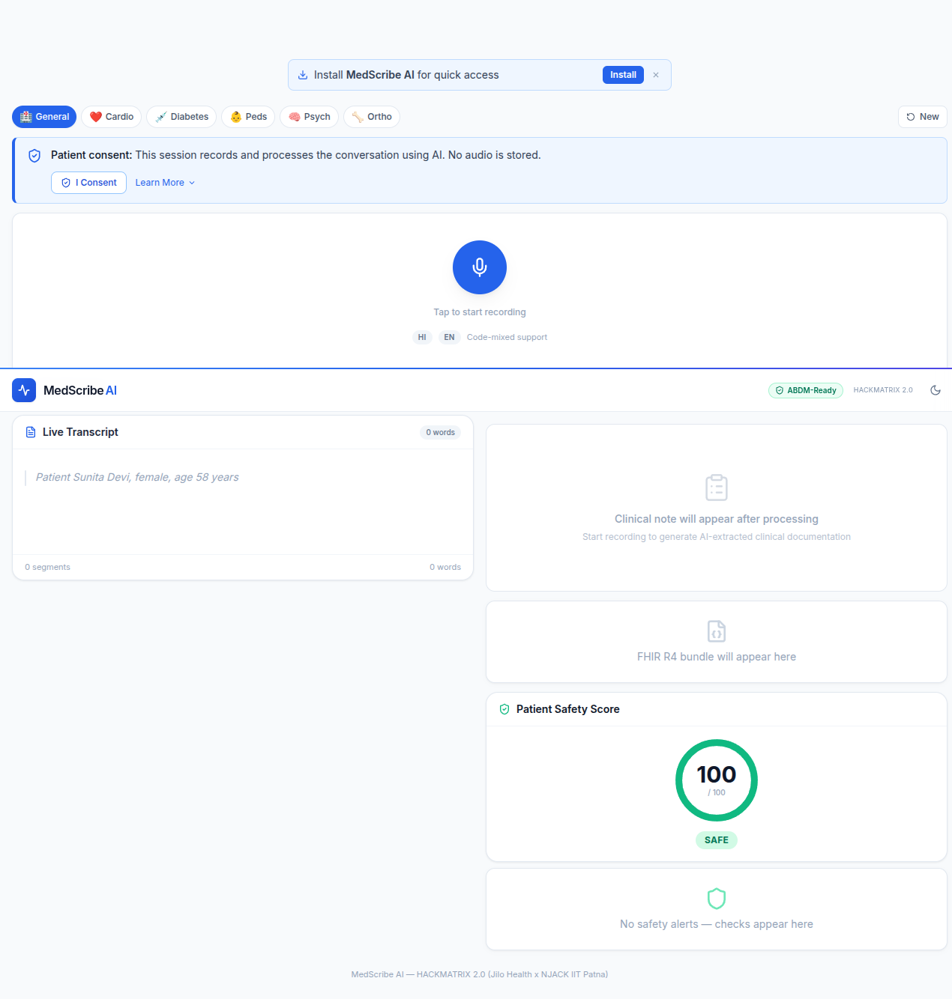
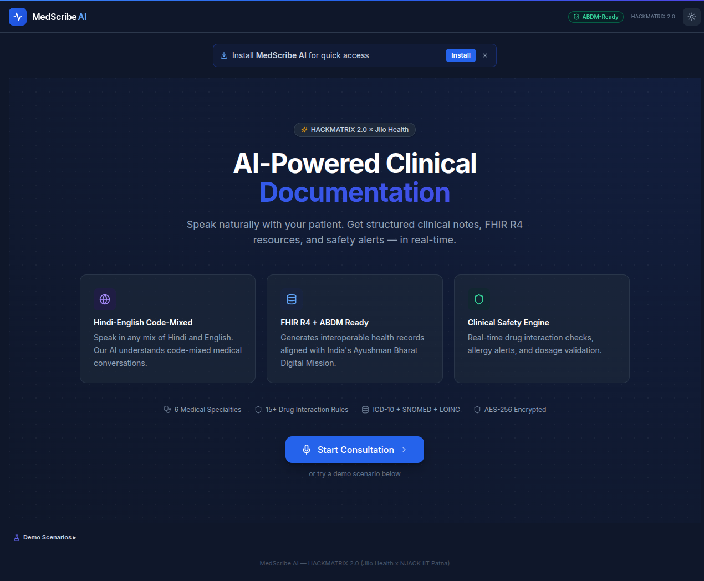

<div align="center">

# MedScribe AI

**Mobile-First Ambient AI Scribe with Real-Time FHIR Conversion**

[](https://hackathon.jilohealth.com/)
[](https://hl7.org/fhir/)
[](https://abdm.gov.in/)
[]()
[]()

*Speak naturally with your patient in Hindi or English. Get structured clinical notes, FHIR R4 resources, and safety alerts — in real-time.*

**Team MedVani** · Built solo by [Akash](https://github.com/Akasxh)

### [**Try the Live Demo →**](https://medscribe-ai-production-851f.up.railway.app/)

</div>

---

## The App in Action

### Mobile Experience (PWA)

<div align="center">
<table>
<tr>
<td><br/><em>Doctor Registration</em></td>
<td><br/><em>Live Recording with Waveform</em></td>
<td><br/><em>Landing Page (PWA Install)</em></td>
</tr>
<tr>
<td><br/><em>Clinical Note + Diagnosis</em></td>
<td><br/><em>Digital Prescription</em></td>
<td><br/><em>Prescription QR Code</em></td>
</tr>
</table>
</div>

### Desktop Experience

<div align="center">
<table>
<tr>
<td><br/><em>Active Session — Transcript + Clinical Note</em></td>
<td><br/><em>Demo Mode Running</em></td>
</tr>
<tr>
<td><br/><em>Consent Banner + Specialty Selector</em></td>
<td><br/><em>Dark Mode (Night Shifts)</em></td>
</tr>
</table>
</div>

---

## Live Demo

> **No setup needed.** Open on your phone or desktop — it's a PWA, works everywhere.
>
> **[https://medscribe-ai-production-851f.up.railway.app/](https://medscribe-ai-production-851f.up.railway.app/)**
>
> Use **Demo Mode** (built-in button) to see the full pipeline without a microphone.

<div align="center">
  
  https://github.com/user-attachments/assets/5f58e6d3-4ba6-44e6-950a-f22f7c64e961
  
</div>
---

## Key Features

- **Hindi-English Code-Mixed Understanding** — *"Patient ko bukhar hai"* becomes Fever (ICD-10: R50.9)
- **Real-Time Clinical Notes** — Structured SOAP notes stream as you speak
- **FHIR R4 Bundle Generation** — 8 resource types with ICD-10, SNOMED CT, LOINC, RxNorm coding
- **Clinical Decision Support** — 15 drug interactions, 3 allergy rules, 10+ dosage checks fire in real-time
- **Prescription QR Code** — Scannable at pharmacy for digital medication handoff
- **Patient Safety Score** — 0-100 composite clinical risk with animated visualization
- **6 Medical Specialties** — Cardiology, Diabetology, Pediatrics, Psychiatry, Orthopedics, General Medicine
- **17+ Indian Drug Mappings** — Dolo, Combiflam, Glycomet, and more mapped to generics
- **Continuous Learning** — Doctor corrections improve future extractions via few-shot injection
- **ABDM/ABHA Ready** — Aligned with Ayushman Bharat Digital Mission
- **AES-256 Encryption** — Clinical data encrypted at rest, security headers enforced
- **Mobile-First PWA** — Installable on any phone, works on flaky networks

---

## How It Works

| Step | What Happens |
|------|-------------|
| **1. Record** | Doctor speaks naturally with the patient in Hindi, English, or code-mixed |
| **2. Extract** | Gemini 2.5 Flash extracts structured clinical entities in real-time |
| **3. Document** | FHIR R4 compliant clinical notes, prescriptions, and QR codes appear instantly |
| **4. Protect** | CDS engine checks drug interactions, allergies, and dosages — alerts fire immediately |

**Result: 13x faster documentation** (~45 seconds vs ~10 minutes manual)

---

## Tech Stack

| Layer | Technology |
|-------|-----------|
| **Frontend** | React 18, Vite, Tailwind CSS, Framer Motion |
| **Backend** | Python FastAPI, WebSocket, Pydantic |
| **AI** | Google Gemini 2.5 Flash (structured JSON extraction) |
| **Speech** | Web Speech API (browser-native, zero cost) |
| **Data Standard** | FHIR R4 (HL7) with ICD-10, SNOMED CT, LOINC, RxNorm |
| **Security** | AES-256 (Fernet), CORS, Security Headers |
| **Deployment** | Docker, Railway |

---

## Quick Start

### Prerequisites

- **Node.js 18+** and **Python 3.10+**
- **Chrome or Edge** (for Web Speech API)
- [Gemini API Key](https://aistudio.google.com/apikey) (free tier works)

### Setup

```bash
# Clone
git clone https://github.com/Akasxh/medscribe-ai.git
cd medscribe-ai

# Backend
echo "GEMINI_API_KEY=your_key_here" > backend/.env
cd backend
python3 -m venv venv
./venv/bin/pip install -r requirements.txt
cd ..

# Frontend
cd frontend && npm install && cd ..

# Run both
npm install
npm run dev
```

Open **http://localhost:5173** in Chrome or Edge.

### Docker

```bash
docker compose up
```

---

## Demo Mode

Four built-in scenarios for reliable presentations — no microphone required:

| Demo | Scenario | Highlights |
|------|----------|-----------|
| **Viral Fever** | Hindi-English OPD, 28M with fever + cough | Drug brand mapping, allergy recording |
| **Diabetes Follow-up** | 52M, HbA1c 8.2%, neuropathy | Chronic disease management, complications screening |
| **Cardiac + Safety** | 58F chest pain, Ecosprin + Combiflam | CDS alerts fire (Aspirin + NSAID interaction) |
| **Telemedicine Rural** | 65F from Rampur, breathlessness | Rural India scenario, CHF management |

---

## Built For

**HACKMATRIX 2.0** — AI/ML in Healthcare Hackathon

- **Organizers**: [Jilo Health](https://jilohealth.com/) x [NJACK IIT Patna](https://njack.iitp.ac.in/)
- **Problem Statement**: PS-1 — Mobile-First Ambient AI Scribe with Real-Time FHIR Conversion
- **Team**: MedVani (Solo — [Akash](https://github.com/Akasxh))

---

<div align="center">

**MedVani** = Med + वाणी (voice in Sanskrit)

*The medical voice that documents for you*

Made with ❤️ for Bharat's healthcare future

</div>
