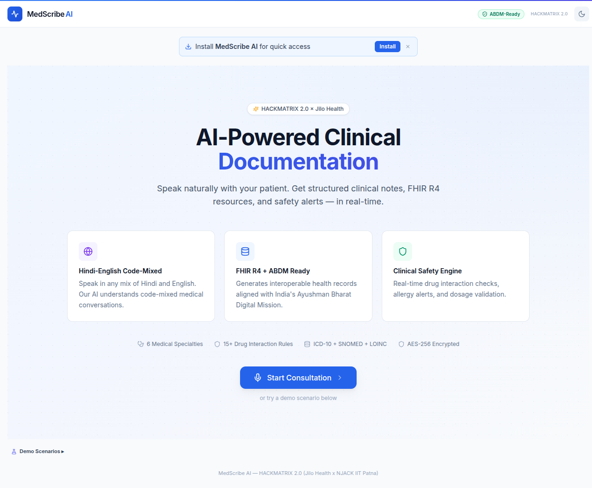

<div align="center">

# 🩺 MedScribe AI

**Mobile-First Ambient AI Scribe with Real-Time FHIR Conversion**

[](https://hackathon.jilohealth.com/)
[](https://hl7.org/fhir/)
[](https://abdm.gov.in/)
[]()
[]()

*Speak naturally with your patient in Hindi or English. Get structured clinical notes, FHIR R4 resources, and safety alerts — in real-time.*

**Team MedVani** · Built solo by [Akash](https://github.com/Akasxh)

[Live Demo](#demo) · [Features](#features) · [Architecture](#architecture) · [Quick Start](#quick-start) · [Documentation](#documentation)

</div>

---

## 🎯 The Problem

> Every doctor in India loses **2+ hours daily** to clinical documentation. With a doctor-patient ratio of **1:1,511** (WHO target: 1:1,000), every minute counts. Existing AI scribes don't support **Hindi-English code-mixed** medical conversations — leaving 400M+ Indians underserved.

| Statistic | Source |
|-----------|--------|
| Doctor-patient ratio: **1:1,511** | WHO / NMC 2024 |
| Documentation burden: **2+ hours/day** per doctor | AIIMS / WHO surveys |
| Doctors in rural India: **25%** (serving **65%** of population) | National Health Profile |
| Telemedicine consultations post-COVID: **10M+/year** | eSanjeevani data |

Commercial ambient scribes (Abridge, Nuance DAX, Suki AI) focus on English-only US healthcare. None handle Hindi-English code-mixing, Indian drug brand names, or ABDM compliance.

---

## 💡 Our Solution

MedScribe AI is a **mobile-first Progressive Web App** that turns doctor-patient conversations into structured clinical documentation in real-time.

| Step | What Happens |
|------|-------------|
| 🎙️ **Record** | Doctor speaks naturally with patient in Hindi, English, or code-mixed |
| 🧠 **Extract** | Gemini 2.5 Flash extracts structured clinical entities in real-time |
| 📋 **Document** | FHIR R4 compliant clinical notes appear as the conversation flows |
| 🛡️ **Protect** | CDS engine checks drug interactions, allergies, and dosages instantly |

**Result: 13x faster documentation** (~45 seconds vs ~10 minutes manual)

---

## ✨ Features

### Core

- 🎙️ **Hindi-English Code-Mixed Understanding** — *"Patient ko bukhar hai"* → Fever (ICD-10: R50.9)
- 📋 **Real-Time Clinical Notes** — Structured SOAP notes stream as you speak
- 🏥 **FHIR R4 Bundle Generation** — 8 resource types with ICD-10, SNOMED CT, LOINC, RxNorm coding
- 🛡️ **Clinical Decision Support** — 15 drug interactions, 3 allergy rules, 10+ dosage checks
- 📱 **Mobile-First PWA** — Installable on any phone, works on flaky networks
- 💊 **17+ Indian Drug Mappings** — Dolo → Paracetamol, Combiflam → Ibuprofen+Paracetamol, Glycomet → Metformin

### Differentiators

- 🇮🇳 **ABDM/ABHA Ready** — Aligned with Ayushman Bharat Digital Mission, ABHA Health ID support
- 🏥 **6 Medical Specialties** — Cardiology, Diabetology, Pediatrics, Psychiatry, Orthopedics, General Medicine
- 📊 **Patient Safety Score** — 0-100 composite clinical risk with animated visualization
- 🧠 **Clinical Nudges** — 13 context-aware rules prompting for missing history, vitals, allergies
- 📚 **Continuous Learning** — "Save & Teach AI" corrections improve future extractions via few-shot injection
- 💊 **Prescription QR Code** — Scannable at pharmacy for digital medication handoff
- 🎤 **Voice Commands** — "Show FHIR", "Show safety" during active recording
- 🔒 **AES-256 Encryption** — Clinical data encrypted at rest with Fernet, security headers enforced
- 👩‍⚕️ **Patient Consent** — HIPAA/DISHA-aware consent recording before documentation begins
- 🔄 **Differential Diagnosis** — AI suggests 2-3 alternative diagnoses with distinguishing tests
- 📊 **FHIR Quality Scoring** — Automated compliance grades (A-D) for every generated bundle

---

## 📸 Screenshots

<div align="center">


<p><em>Professional landing page with feature highlights and quick-start access</em></p>

<br/>


<p><em>Active session with specialty selector, patient consent banner, and safety score</em></p>

<br/>


<p><em>Full dark mode support — built for doctors working night shifts</em></p>

</div>

---

## 🏗️ Architecture

```
┌─────────────────────────────────────────────────────────────────┐
│                    FRONTEND (React 18 PWA)                       │
│                                                                 │
│  Web Speech API ──→ Live Transcript ──→ Clinical Note View      │
│                                                                 │
│  ┌──────────────┐ ┌──────────────┐ ┌──────────────────────────┐ │
│  │ Specialty    │ │ CDS Alerts   │ │ Export Suite             │ │
│  │ Selector     │ │ + Safety     │ │ Print / FHIR JSON /     │ │
│  │ (6 types)    │ │ Score Card   │ │ Clipboard / QR Code     │ │
│  └──────────────┘ └──────────────┘ └──────────────────────────┘ │
│                                                                 │
│  ┌──────────────┐ ┌──────────────┐ ┌──────────────────────────┐ │
│  │ Clinical     │ │ Consent      │ │ PWA Install Prompt       │ │
│  │ Nudges (13)  │ │ Banner       │ │ + Dark Mode Toggle       │ │
│  └──────────────┘ └──────────────┘ └──────────────────────────┘ │
└─────────────────────┬───────────────────────────────────────────┘
                      │ WebSocket (bidirectional)
┌─────────────────────▼───────────────────────────────────────────┐
│                    BACKEND (Python FastAPI)                      │
│                                                                 │
│  ┌──────────────┐  ┌──────────────┐  ┌────────────────────────┐ │
│  │ WebSocket    │  │ Gemini 2.5   │  │ FHIR R4 Mapper         │ │
│  │ Manager      │→ │ Flash        │→ │ + Quality Scoring      │ │
│  │ (sessions)   │  │ (structured  │  │ (Grade A-D)            │ │
│  │              │  │  extraction) │  │ + Terminology Valid.   │ │
│  └──────────────┘  └──────────────┘  └────────────────────────┘ │
│                                                                 │
│  ┌──────────────┐  ┌──────────────┐  ┌────────────────────────┐ │
│  │ CDS Engine   │  │ Learning     │  │ Encryption Service     │ │
│  │ 15 drug Ix   │  │ Service      │  │ AES-256 (Fernet)       │ │
│  │ 3 allergy Rx │  │ (few-shot    │  │ + Security Headers     │ │
│  │ 10+ dosage   │  │  corrections)│  │                        │ │
│  └──────────────┘  └──────────────┘  └────────────────────────┘ │
└─────────────────────────────────────────────────────────────────┘
```

---

## 🛠️ Tech Stack

| Layer | Technology | Why |
|-------|-----------|-----|
| **Frontend** | React 18, Vite, Tailwind CSS, Framer Motion | Fast builds, utility-first CSS, PWA-ready |
| **Backend** | Python FastAPI, WebSocket, Pydantic | Async-native, real-time bidirectional comms |
| **AI** | Google Gemini 2.5 Flash | Fast structured JSON output, multilingual, free tier |
| **Speech** | Web Speech API (browser-native) | Zero cost, no API key, Hindi-English support |
| **Data Standard** | FHIR R4 (HL7) | International interoperability, ABDM alignment |
| **Coding Systems** | ICD-10, SNOMED CT, LOINC, RxNorm | Standard medical terminologies |
| **Security** | AES-256 (Fernet), Security Headers | Clinical data protection at rest and in transit |
| **Deployment** | Docker, Railway, Render | One-command deploy, auto-scaling |

---

## 🚀 Quick Start

### Prerequisites

- **Node.js 18+** and **Python 3.10+**
- **Chrome or Edge** browser (for Web Speech API)
- [Gemini API Key](https://aistudio.google.com/apikey) (free tier works)

### Setup

```bash
# Clone the repository
git clone https://github.com/Akasxh/medscribe-ai.git
cd medscribe-ai

# Set your Gemini API key
echo "GEMINI_API_KEY=your_key_here" > backend/.env

# Install and run backend
cd backend
python3 -m venv venv
./venv/bin/pip install -r requirements.txt
cd ..

# Install and run frontend
cd frontend && npm install && cd ..

# Run both services concurrently
npm install
npm run dev
```

Open **http://localhost:5173** in Chrome or Edge.

### Docker

```bash
docker compose up
```

That's it. One command, full stack running.

---

## 🎮 Demo Mode

Four built-in demo scenarios for reliable presentations — no microphone required:

| Demo | Scenario | Highlights |
|------|----------|-----------|
| 🤒 **Viral Fever** | Hindi-English OPD visit, 28M with fever + cough | Drug brand mapping, allergy recording, Hindi symptom translation |
| 💊 **Diabetes Follow-up** | 52M, HbA1c 8.2%, neuropathy symptoms | Chronic disease management, medication titration, complications screening |
| ❤️ **Cardiac + Safety** | 58F chest pain, Ecosprin + Combiflam prescribed | **CDS alerts fire** (Aspirin + NSAID interaction), allergy cross-reactivity |
| 📱 **Telemedicine Rural** | 65F from Rampur, breathlessness + pedal edema | Rural India scenario, CHF management, emergency instructions |

Each demo streams transcript segments with realistic timing delays, simulating a live consultation end-to-end.

---

## 📊 Impact

| Metric | Manual Process | With MedScribe AI | Improvement |
|--------|---------------|-------------------|-------------|
| **Documentation time** | ~10 min/consultation | ~45 seconds | **13x faster** |
| **Completeness** | ~30% details missed under pressure | All mentioned entities captured | **Significantly improved** |
| **Safety checks** | Relies on doctor's memory | Real-time CDS with 28+ rules | **Automated** |
| **FHIR compliance** | Manual coding (rarely done) | Auto-generated with quality scoring | **100% structured** |
| **Interoperability** | Paper/proprietary formats | FHIR R4 + ABDM-ready | **Standards-compliant** |
| **STT cost** | $0.006–0.024/min (paid APIs) | Web Speech API | **$0** |

> **At scale**: If adopted by 100,000 Indian doctors seeing 40 patients/day, MedScribe AI could save **333,000 doctor-hours per day** — equivalent to adding 41,600 full-time doctors to India's healthcare system.

---

## 📁 Project Structure

```
medscribe-ai/
├── frontend/                    # React 18 PWA (Vite + Tailwind)
│   └── src/
│       ├── components/          # 24 React components
│       │   ├── RecordButton     # Mic with pulse animation + waveform
│       │   ├── LiveTranscript   # Streaming transcript display
│       │   ├── ClinicalNote     # Editable note + "Save & Teach AI"
│       │   ├── FHIRViewer       # FHIR resource cards + raw JSON
│       │   ├── CDSAlerts        # Drug interaction / allergy alerts
│       │   ├── SafetyScoreCard  # Patient safety score (0-100)
│       │   ├── ClinicalNudges   # 13 context-aware prompts
│       │   ├── SpecialtySelector# 6 medical specialties
│       │   ├── DemoMode         # 4 demo conversations
│       │   ├── PrescriptionQR   # QR code for pharmacy handoff
│       │   ├── ConsentBanner    # Patient consent recording
│       │   └── ...              # ExportPanel, Summary, Metrics, etc.
│       ├── hooks/               # useAudioRecorder, useWebSocket, useSafety
│       └── utils/               # FHIR templates, formatters
├── backend/                     # Python FastAPI
│   ├── services/
│   │   ├── gemini_service       # Gemini 2.5 Flash extraction
│   │   ├── fhir_service         # FHIR R4 resource builder
│   │   ├── cds_service          # 584-line CDS engine
│   │   ├── learning_service     # Continuous learning from corrections
│   │   ├── encryption_service   # AES-256 data encryption
│   │   └── terminology_service  # ICD-10 + drug name validation
│   ├── prompts/                 # Clinical extraction system prompt + specialty addendums
│   ├── models/                  # Pydantic schemas + FHIR models
│   └── data/                    # Drug reference DB, ICD-10 codes
├── docs/                        # Presentation, proposal, screenshots
├── Dockerfile                   # Multi-stage build
├── docker-compose.yml           # One-command deployment
├── railway.json                 # Railway deployment config
└── render.yaml                  # Render deployment config
```

---

## 🔒 Security & Privacy

| Measure | Implementation |
|---------|---------------|
| **Encryption at rest** | AES-256 via Fernet — all clinical data encrypted |
| **Security headers** | X-Frame-Options, CSP, X-XSS-Protection, HSTS |
| **Patient consent** | Consent banner required before recording begins |
| **No audio storage** | Audio processed in-browser by Web Speech API; only text reaches backend |
| **Microphone policy** | `Feature-Policy: microphone 'self'` — no third-party access |
| **DISHA alignment** | Designed with India's Digital Information Security in Healthcare Act principles |

---

## 🗺️ Roadmap

| Phase | Milestone | Timeline |
|-------|-----------|----------|
| **Phase 2** | EHR integration (Practo, HealthPlix, Eka Care) via FHIR APIs | 3-6 months |
| **Phase 3** | Regional language support (Tamil, Telugu, Bengali, Marathi, Kannada) | 6-9 months |
| **Phase 4** | Multi-doctor session management + department-level analytics | 9-12 months |
| **Phase 5** | Edge deployment with quantized local models for offline rural use | 12-18 months |
| **Phase 6** | ABDM Health Locker integration + patient-facing health records | 18-24 months |

---

## 📄 Documentation

- [Solution Summary](docs/SOLUTION_SUMMARY.md) — Comprehensive technical overview
- [Setup Instructions](INSTRUCTIONS.md) — Detailed setup and usage guide
- [Presentation](docs/presentation.html) — Interactive slide deck (arrow keys to navigate)

---

## 🏆 Built For

**HACKMATRIX 2.0** — AI/ML in Healthcare Hackathon

- **Organizers**: [Jilo Health](https://jilohealth.com/) × [NJACK IIT Patna](https://njack.iitp.ac.in/)
- **Problem Statement**: PS-1 — Mobile-First Ambient AI Scribe with Real-Time FHIR Conversion
- **Team**: MedVani (Solo — [Akash](https://github.com/Akasxh))

---

<div align="center">

**MedVani** = Med + वाणी (voice in Sanskrit)

*The medical voice that documents for you*

Made with ❤️ for Bharat's healthcare future

</div>
