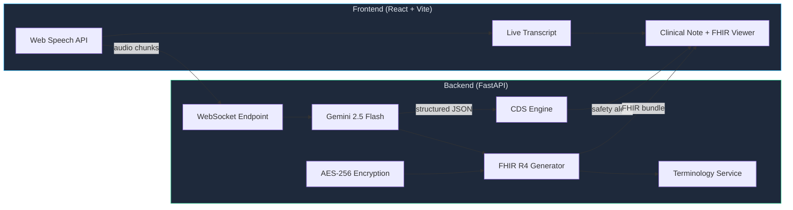
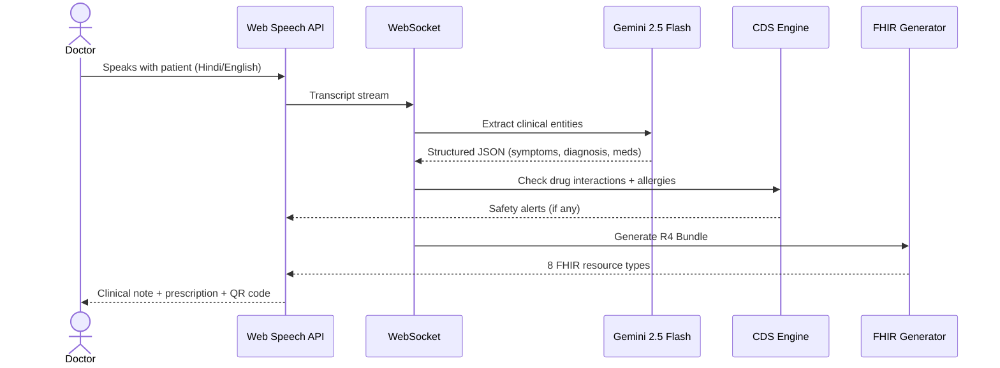

<div align="center">

# MedScribe AI

**Mobile-first ambient clinical scribe with real-time FHIR R4 conversion**

[](https://hackathon.jilohealth.com/)
[](https://hl7.org/fhir/)
[](https://abdm.gov.in/)
[]()

*Speak naturally with your patient in Hindi or English. Get structured clinical notes, FHIR R4 resources, and safety alerts — in real-time.*

**[Try the Live Demo](https://medscribe-ai-production-851f.up.railway.app/)**

</div>

---

## Screenshots

### Mobile (PWA)

<div align="center">
<table>
<tr>
<td><br/><em>Doctor Registration</em></td>
<td><br/><em>Live Recording</em></td>
<td><br/><em>Landing (PWA)</em></td>
</tr>
<tr>
<td><br/><em>Clinical Note</em></td>
<td><br/><em>Digital Prescription</em></td>
<td><br/><em>Prescription QR</em></td>
</tr>
</table>
</div>

### Desktop

| Active Session | Demo Mode |
|:-:|:-:|
|  |  |

---

## Architecture


```mermaid
graph LR
    subgraph Client["Frontend (React + Vite)"]
        MIC[Web Speech API] --> TR[Live Transcript]
        TR --> UI[Clinical Note + FHIR Viewer]
    end

    subgraph Server["Backend (FastAPI)"]
        WS[WebSocket Endpoint]
        GEM[Gemini 2.5 Flash]
        CDS[CDS Engine]
        FHIR[FHIR R4 Generator]
        TERM[Terminology Service]
        ENC[AES-256 Encryption]
    end

    MIC -->|audio chunks| WS
    WS --> GEM
    GEM -->|structured JSON| CDS
    GEM --> FHIR
    FHIR --> TERM
    CDS -->|safety alerts| UI
    FHIR -->|FHIR bundle| UI
    ENC --> FHIR

    style Client fill:#1e293b,stroke:#38bdf8,color:#e2e8f0
    style Server fill:#1e293b,stroke:#34d399,color:#e2e8f0
```

### Clinical Data Pipeline


```mermaid
sequenceDiagram
    actor D as Doctor
    participant Browser as Web Speech API
    participant WS as WebSocket
    participant Gemini as Gemini 2.5 Flash
    participant CDS as CDS Engine
    participant FHIR as FHIR Generator

    D->>Browser: Speaks with patient (Hindi/English)
    Browser->>WS: Transcript stream
    WS->>Gemini: Extract clinical entities
    Gemini-->>WS: Structured JSON (symptoms, diagnosis, meds)
    WS->>CDS: Check drug interactions + allergies
    CDS-->>Browser: Safety alerts (if any)
    WS->>FHIR: Generate R4 Bundle
    FHIR-->>Browser: 8 FHIR resource types
    Browser-->>D: Clinical note + prescription + QR code
```

---

## Features

- **Hindi-English code-mixed understanding** — *"Patient ko bukhar hai"* becomes Fever (ICD-10: R50.9)
- **Real-time SOAP notes** — structured clinical notes stream as the doctor speaks
- **FHIR R4 bundle generation** — 8 resource types with ICD-10, SNOMED CT, LOINC, RxNorm coding
- **Clinical Decision Support** — 15 drug interactions, 3 allergy rules, 10+ dosage checks
- **Prescription QR code** — scannable at pharmacy for digital medication handoff
- **Patient safety score** — 0-100 composite clinical risk with animated visualization
- **6 medical specialties** — Cardiology, Diabetology, Pediatrics, Psychiatry, Orthopedics, General Medicine
- **17+ Indian drug mappings** — Dolo, Combiflam, Glycomet mapped to generics
- **Continuous learning** — doctor corrections improve future extractions via few-shot injection
- **ABDM/ABHA aligned** — Ayushman Bharat Digital Mission compatible
- **AES-256 encryption** — clinical data encrypted at rest
- **Mobile-first PWA** — installable on any phone, works on flaky networks

---

## How It Works

| Step | What Happens |
|------|-------------|
| **1. Record** | Doctor speaks naturally with patient in Hindi, English, or code-mixed |
| **2. Extract** | Gemini 2.5 Flash extracts structured clinical entities in real-time |
| **3. Document** | FHIR R4 clinical notes, prescriptions, and QR codes appear instantly |
| **4. Protect** | CDS engine checks drug interactions, allergies, dosages — alerts fire immediately |

**Result: ~45 seconds vs ~10 minutes for manual documentation.**

---

## Quick Start

### Prerequisites

- Node.js 18+ and Python 3.10+
- Chrome or Edge (for Web Speech API)
- [Gemini API Key](https://aistudio.google.com/apikey) (free tier works)

### Setup

```bash
git clone https://github.com/Akasxh/medscribe-ai.git
cd medscribe-ai

# Backend
echo "GEMINI_API_KEY=your_key_here" > backend/.env
cd backend
python3 -m venv venv
./venv/bin/pip install -r requirements.txt
cd ..

# Frontend
cd frontend && npm install && cd ..

# Run both
npm install
npm run dev
```

Open **http://localhost:5173** in Chrome or Edge.

### Docker

```bash
docker compose up
```

---

## Demo Mode

Four built-in scenarios for testing without a microphone:

| Demo | Scenario | Highlights |
|------|----------|-----------|
| **Viral Fever** | Hindi-English OPD, 28M with fever + cough | Drug brand mapping, allergy recording |
| **Diabetes Follow-up** | 52M, HbA1c 8.2%, neuropathy | Chronic disease management |
| **Cardiac + Safety** | 58F chest pain, Ecosprin + Combiflam | CDS alerts (Aspirin + NSAID interaction) |
| **Telemedicine Rural** | 65F from Rampur, breathlessness | Rural India scenario, CHF management |

---

## Project Structure

```
medscribe-ai/
├── backend/
│   ├── services/
│   │   ├── gemini_service.py       # Gemini 2.5 Flash integration
│   │   ├── stt_service.py          # Speech-to-text coordination
│   │   ├── cds_service.py          # Clinical Decision Support engine
│   │   ├── fhir_service.py         # FHIR R4 bundle generation
│   │   ├── terminology_service.py  # ICD-10, SNOMED CT, LOINC mappings
│   │   ├── encryption_service.py   # AES-256 (Fernet)
│   │   └── learning_service.py     # Few-shot learning from corrections
│   ├── models/
│   │   ├── schemas.py              # Pydantic models
│   │   └── fhir_models.py          # FHIR resource types
│   ├── prompts/
│   │   └── clinical_extraction.py  # Gemini prompt templates
│   ├── routers/
│   │   ├── transcribe.py           # WebSocket transcription endpoint
│   │   └── sessions.py             # Session management
│   ├── data/
│   │   ├── icd10_common.json       # ICD-10 code mappings
│   │   └── drug_reference.json     # Drug interaction database
│   ├── main.py
│   └── requirements.txt
├── frontend/
│   ├── src/
│   │   ├── components/             # 20+ React components
│   │   ├── hooks/                  # useAudioRecorder, useWebSocket, useSafetyScore
│   │   └── utils/                  # FHIR templates, formatters
│   ├── package.json
│   └── vite.config.js
├── docs/
│   └── screenshots/
├── docker-compose.yml
├── Dockerfile
└── package.json                    # Root: runs both frontend + backend
```

---

## Tech Stack

| Layer | Technology |
|-------|-----------|
| **Frontend** | React 18, Vite, Tailwind CSS, Framer Motion |
| **Backend** | Python FastAPI, WebSocket, Pydantic |
| **AI** | Google Gemini 2.5 Flash (structured JSON extraction) |
| **Speech** | Web Speech API (browser-native, zero cost) |
| **Data Standard** | FHIR R4 (HL7) with ICD-10, SNOMED CT, LOINC, RxNorm |
| **Security** | AES-256 (Fernet), CORS, Security Headers |
| **Deployment** | Docker, Railway |

---

## Built For

**HACKMATRIX 2.0** — AI/ML in Healthcare Hackathon

- **Organizers**: [Jilo Health](https://jilohealth.com/) x [NJACK IIT Patna](https://njack.iitp.ac.in/)
- **Problem Statement**: PS-1 — Mobile-First Ambient AI Scribe with Real-Time FHIR Conversion
- **Team**: MedVani (Solo)

---

## Contributing

1. Fork the repository
2. Create a feature branch: `git checkout -b feature/my-feature`
3. Commit with conventional commits
4. Open a pull request against `master`

---

## License

MIT
