<div align="center">

# MedScribe AI

### Mobile-First Ambient AI Scribe with Real-Time FHIR R4 Conversion

[](https://hackathon.jilohealth.com/)
[](https://hl7.org/fhir/)
[](https://abdm.gov.in/)
[]()
[]()

*A doctor opens the app, speaks with their patient in Hindi or English, and structured clinical notes + FHIR R4 resources + safety alerts appear in real-time.*

### **~45 seconds** vs **~10 minutes** for manual documentation

**[Try the Live Demo](https://medscribe-ai-production-851f.up.railway.app/)**

</div>

---

## The Problem

Indian doctors spend **3-4 hours daily** on clinical documentation. Existing solutions (Abridge, DAX, DeepCura) don't support **Hindi-English code-mixing**, lack **ABDM/ABHA alignment**, and have no **clinical safety checks**. Rural and non-metro India is completely unserved.

## The Solution

| Step | What Happens |
|:----:|-------------|
| **1. Speak** | Doctor speaks naturally with patient — Hindi, English, or code-mixed |
| **2. Extract** | Gemini 2.5 Flash extracts structured clinical entities in real-time |
| **3. Document** | FHIR R4 clinical notes, digital prescription, and QR code appear instantly |
| **4. Protect** | CDS engine checks drug interactions, allergies, dosages — alerts fire immediately |

---

## Screenshots

<div align="center">
<table>
<tr>
<td>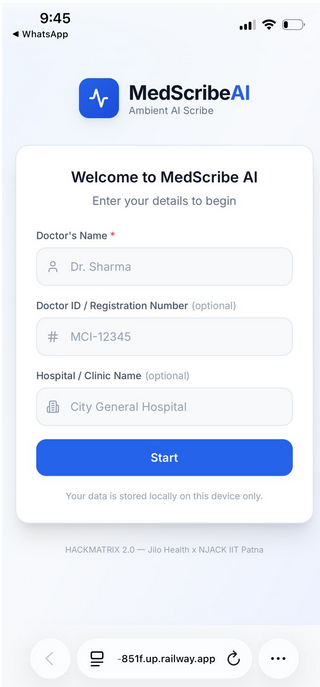<br/><em>Doctor Registration</em></td>
<td>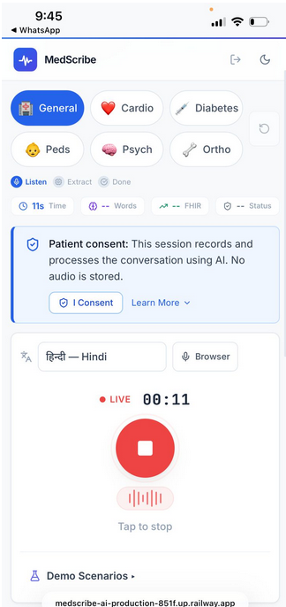<br/><em>Live Recording</em></td>
<td>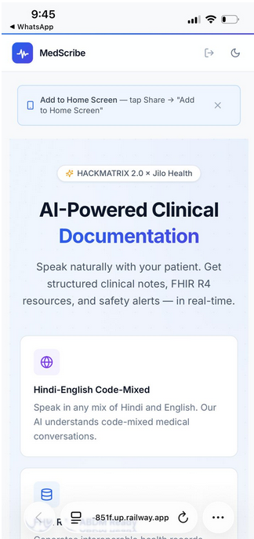<br/><em>Landing (PWA)</em></td>
</tr>
<tr>
<td>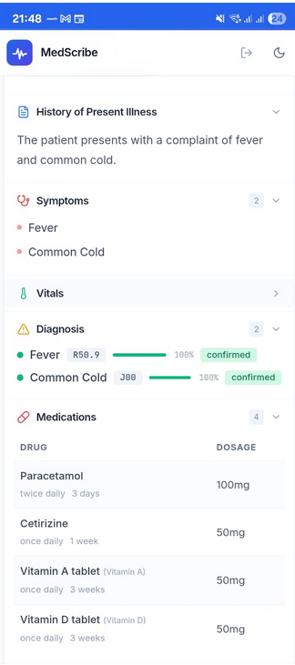<br/><em>Clinical Note</em></td>
<td>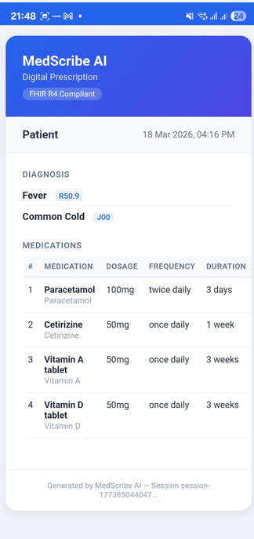<br/><em>Digital Prescription</em></td>
<td>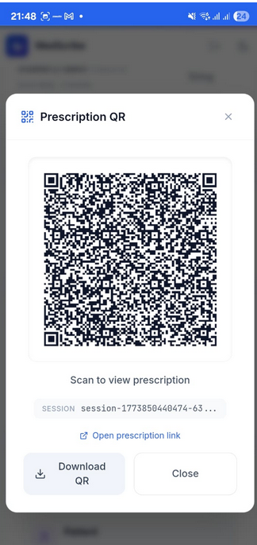<br/><em>Prescription QR</em></td>
</tr>
</table>
</div>

| Active Session (Desktop) | Demo Mode |
|:-:|:-:|
| 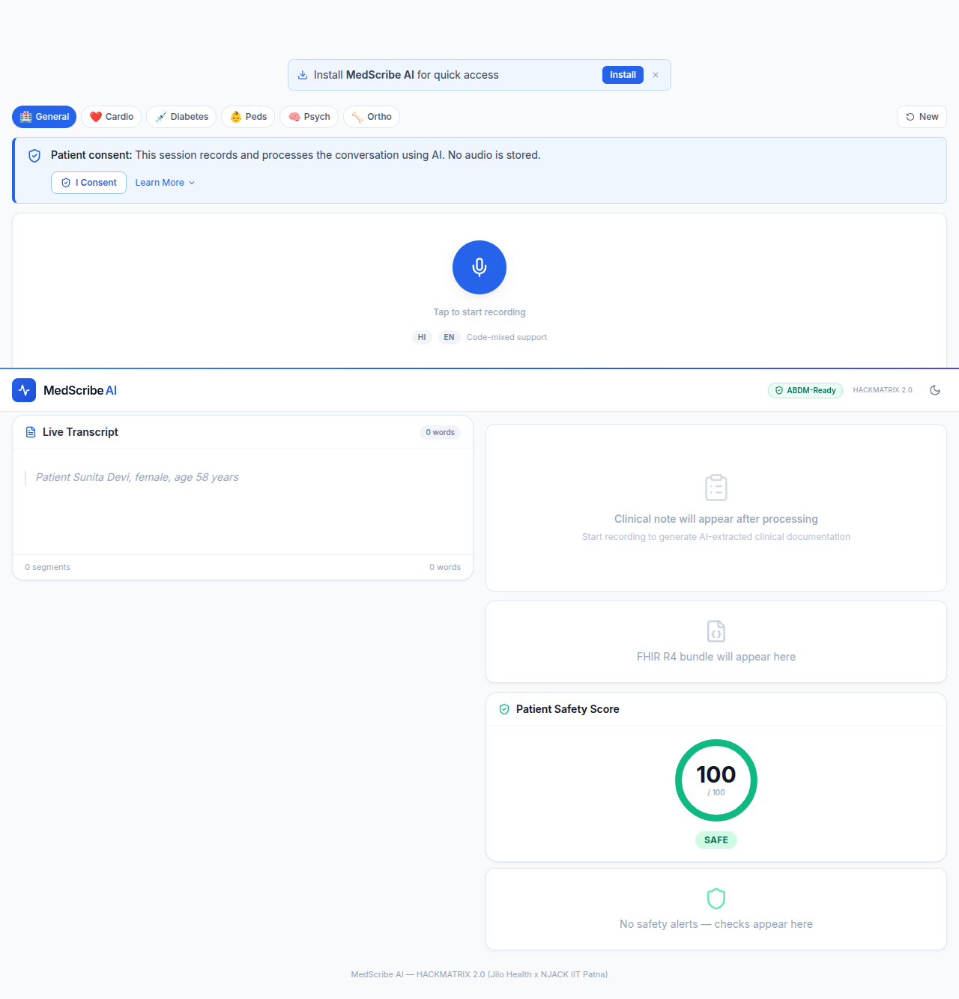 | 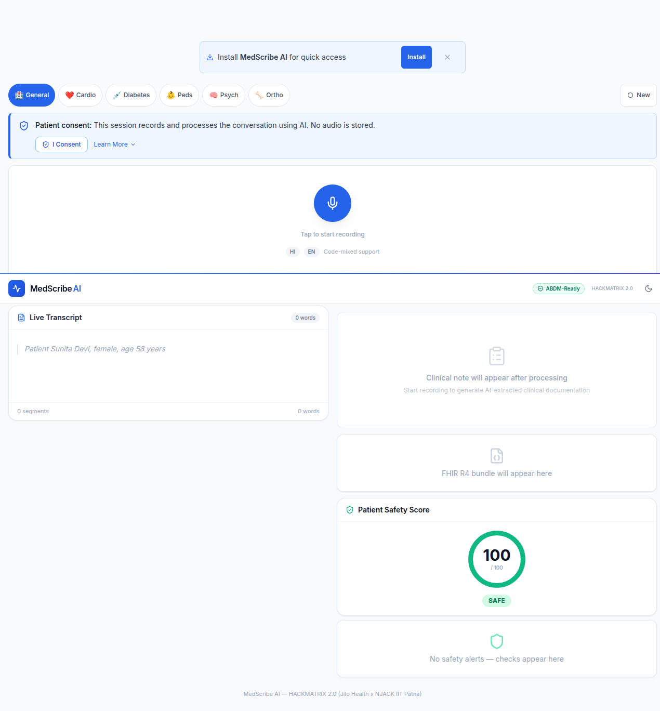 |

---

## What Makes Us Different

<table>
<tr>
<td width="50%">

### Clinical Intelligence
- **Hindi-English code-mixing** — *"Patient ko bukhar hai"* → Fever (ICD-10: R50.9)
- **60+ Indian drug mappings** — Dolo, Combiflam, Glycomet → generics with SNOMED coding
- **Clinical Decision Support** — 15+ drug interactions, allergy cross-reactivity (Penicillin↔Cephalosporin), dosage validation
- **Differential diagnosis** — AI suggests 2-3 alternatives with supporting evidence
- **Continuous learning** — doctor corrections improve future extractions via few-shot injection

</td>
<td width="50%">

### Standards & Compliance
- **FHIR R4 Document Bundle** — Composition + 8 resource types (Patient, Encounter, Condition, Observation, MedicationRequest, AllergyIntolerance, CarePlan, ServiceRequest)
- **Terminology coding** — ICD-10-CM, SNOMED CT, LOINC, RxNorm
- **ABDM/ABHA aligned** — Ayushman Bharat Digital Mission compatible
- **Prescription QR code** — scannable at pharmacy for digital medication handoff
- **6 specialties** — Cardiology, Diabetology, Pediatrics, Psychiatry, Orthopedics, General Medicine

</td>
</tr>
</table>

---

## Architecture

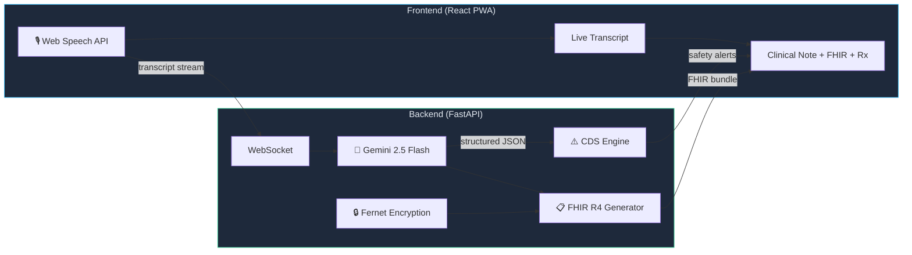
```mermaid
graph LR
    subgraph Client["Frontend (React PWA)"]
        MIC["🎙 Web Speech API"] --> TR[Live Transcript]
        TR --> UI["Clinical Note + FHIR + Rx"]
    end

    subgraph Server["Backend (FastAPI)"]
        WS[WebSocket]
        GEM["🧠 Gemini 2.5 Flash"]
        CDS["⚠️ CDS Engine"]
        FHIR["📋 FHIR R4 Generator"]
        ENC["🔒 Fernet Encryption"]
    end

    MIC -->|transcript stream| WS
    WS --> GEM
    GEM -->|structured JSON| CDS
    GEM --> FHIR
    CDS -->|safety alerts| UI
    FHIR -->|FHIR bundle| UI
    ENC --> FHIR

    style Client fill:#1e293b,stroke:#38bdf8,color:#e2e8f0
    style Server fill:#1e293b,stroke:#34d399,color:#e2e8f0
```

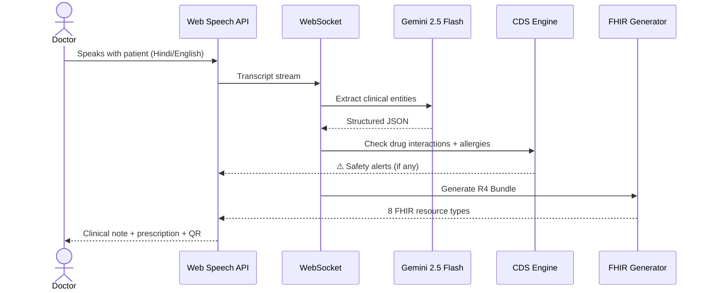
```mermaid
sequenceDiagram
    actor D as Doctor
    participant B as Web Speech API
    participant WS as WebSocket
    participant G as Gemini 2.5 Flash
    participant CDS as CDS Engine
    participant F as FHIR Generator

    D->>B: Speaks with patient (Hindi/English)
    B->>WS: Transcript stream
    WS->>G: Extract clinical entities
    G-->>WS: Structured JSON
    WS->>CDS: Check drug interactions + allergies
    CDS-->>B: ⚠️ Safety alerts (if any)
    WS->>F: Generate R4 Bundle
    F-->>B: 8 FHIR resource types
    B-->>D: Clinical note + prescription + QR
```

---

## Security & Data Encryption

All clinical data is encrypted at rest using **Fernet (AES-128-CBC + HMAC-SHA256)**. Patient names, diagnoses, medications, and vitals are **never** stored or transmitted in plaintext.

<div align="center">
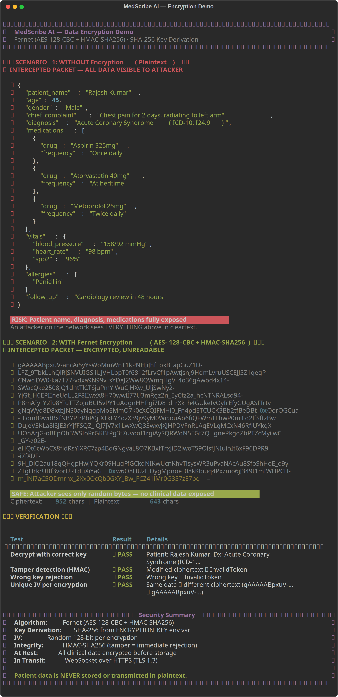
<br/><em>Simulated packet interception: plaintext clinical data (top, red) vs Fernet-encrypted ciphertext (bottom, green).<br/>Verification table confirms tamper detection, wrong-key rejection, and unique IV per encryption.</em>
</div>

> **Run it yourself:** `ENCRYPTION_KEY=your-secret python backend/demo_encryption.py`

| Test | Result | What it means |
|------|:------:|--------------|
| Encrypt → Decrypt roundtrip | ✅ | All clinical fields recovered, zero data loss |
| Tamper detection (HMAC) | ✅ | Flip 1 byte in ciphertext → `InvalidToken` |
| Wrong key rejection | ✅ | Only the key holder can decrypt clinical data |
| Unique IV per encryption | ✅ | Same plaintext → different ciphertext every time |

**Security headers:** X-Frame-Options `DENY`, CSP, HSTS, XSS protection, Referrer-Policy, Permissions-Policy (microphone only).

**Additional protections:** Path traversal prevention, HTML escaping, session TTL eviction, transcript size caps, hash-based deduplication, specialty allowlist, and **29 automated tests**.

---

## Demo Mode

Four built-in scenarios — no microphone needed:

| Demo | Scenario | What it showcases |
|------|----------|-------------------|
| **Viral Fever** | 28M, Hindi-English OPD, fever + cough | Drug brand mapping (Dolo → Paracetamol), allergy recording |
| **Diabetes Follow-up** | 52M, HbA1c 8.2%, neuropathy | Chronic disease management, multi-medication |
| **Cardiac + Safety** | 58F, chest pain, Ecosprin + Combiflam | **CDS alert**: Aspirin + NSAID interaction detected |
| **Telemedicine Rural** | 65F, Rampur, breathlessness | Rural India scenario, CHF management, telemedicine |

---

## Quick Start

```bash
git clone https://github.com/Akasxh/medscribe-ai.git && cd medscribe-ai

# Backend
echo "GEMINI_API_KEY=your_key" > backend/.env
cd backend && python3 -m venv venv && ./venv/bin/pip install -r requirements.txt && cd ..

# Frontend
cd frontend && npm install && cd ..

# Run
npm install && npm run dev
```

Open **http://localhost:5173** in Chrome/Edge. Or: `docker compose up`

---

## Tech Stack

| Layer | Technology |
|-------|-----------|
| **Frontend** | React 18, Vite, Tailwind CSS, Framer Motion |
| **Backend** | Python FastAPI, WebSocket, Pydantic |
| **AI** | Google Gemini 2.5 Flash (structured JSON extraction) |
| **Speech** | Web Speech API (browser-native, zero API cost) |
| **Data Standard** | FHIR R4 (HL7) — ICD-10, SNOMED CT, LOINC, RxNorm |
| **Security** | Fernet (AES-128-CBC + HMAC-SHA256), CSP, HSTS |
| **Deployment** | Docker, Railway |

---

<div align="center">

### Built for HACKMATRIX 2.0

**AI/ML in Healthcare** — [Jilo Health](https://jilohealth.com/) × [NJACK IIT Patna](https://njack.iitp.ac.in/)

PS-1: Mobile-First Ambient AI Scribe with Real-Time FHIR Conversion

**Team MedVani** (Solo)

---

MIT License

</div>
