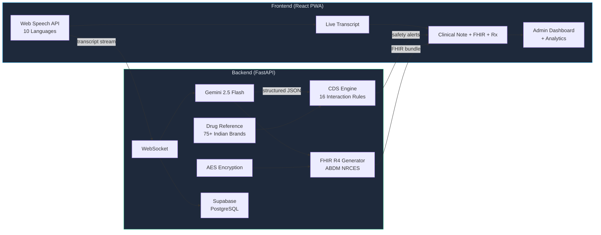
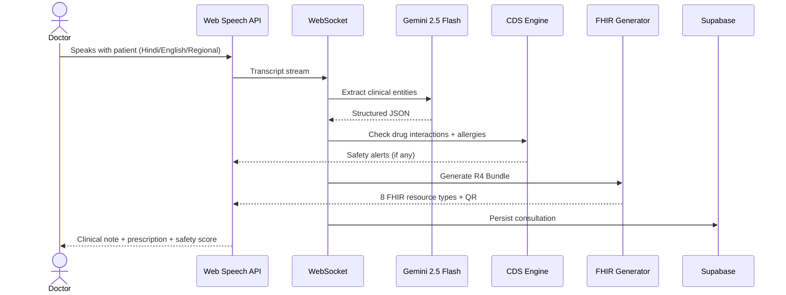

<div align="center">

# MedScribe AI

### Mobile-First Ambient AI Scribe with Real-Time FHIR R4 Conversion

[](https://hackathon.jilohealth.com/)
[](https://hl7.org/fhir/)
[](https://abdm.gov.in/)
[]()
[]()

A doctor opens the app, speaks with their patient in Hindi, English, or any of 10 Indian languages, and structured clinical notes + FHIR R4 resources + drug safety alerts appear in real-time.

### **~45 seconds** vs **~10 minutes** for manual documentation

**[Try the Live Demo](https://medscribe-ai-production-851f.up.railway.app/)**

</div>

---

## The Problem

Indian doctors spend **3-4 hours daily** on clinical documentation. Existing solutions don't support **Hindi-English code-mixing**, lack **ABDM/ABHA alignment**, have no **clinical safety checks**, and ignore the **Indian drug ecosystem** entirely. Rural and non-metro India is completely unserved.

## The Solution

| Step | What Happens |
|:----:|-------------|
| **1. Speak** | Doctor speaks naturally with patient -- Hindi, English, Tamil, Telugu, Bengali, or code-mixed |
| **2. Extract** | Gemini 2.5 Flash extracts structured clinical entities in real-time |
| **3. Document** | FHIR R4 clinical notes, digital prescription, and QR code appear instantly |
| **4. Protect** | CDS engine checks drug interactions, allergies, dosages -- safety alerts fire immediately |

---

## Indian Drug Ecosystem -- A Key Differentiator

No other AI scribe understands the Indian pharmaceutical landscape. MedScribe AI maps **75+ Indian drug brand names** to their international generic equivalents, complete with RxNorm coding and affordable alternatives.

### Brand-to-Generic Mapping with Indian Context

| Prescribed | Generic | RxNorm | Category | Alternatives |
|-----------|---------|:------:|----------|-------------|
| Crocin 500mg | Paracetamol | 161 | Antipyretic | Dolo, Calpol, Tylenol |
| Glycomet 500mg | Metformin | 6809 | Antidiabetic | Glucophage, Obimet, Walaphage |
| Azithral 500mg | Azithromycin | 18631 | Antibiotic | Zithromax, Azee, Azifast |
| Ecosprin 75mg | Aspirin | 1191 | Antiplatelet | Disprin, Loprin |
| Telma 40mg | Telmisartan | 73057 | Antihypertensive | Telmikind, Telvas, Sartel |
| Combiflam | Ibuprofen + Paracetamol | 5640 | NSAID | Flexon, Brufen Plus |
| Atorva 10mg | Atorvastatin | 83367 | Statin | Lipitor, Atocor, Storvas |
| Nexito 10mg | Escitalopram | 321988 | SSRI | Lexapro, Stalopam, S Citadep |

**How it works:**
- Doctor says *"Crocin do teen din ke liye"* -- system maps to **Paracetamol (RxNorm: 161)**
- Clicking any drug name shows a **modal with all alternatives**, schedule classification (OTC/H/H1), and Jan Aushadhi (government generic) options
- Drug interactions are checked against the **generic name**, not the brand -- so Ecosprin + Combiflam correctly triggers an **Aspirin + NSAID interaction alert**
- Covers all major therapeutic categories: antibiotics, antihypertensives, antidiabetics, statins, PPIs, NSAIDs, bronchodilators, anticonvulsants, SSRIs, and more

---

## Screenshots

<div align="center">
<table>
<tr>
<td><br/><em>Doctor Registration</em></td>
<td><br/><em>Live Recording</em></td>
<td><br/><em>Landing (PWA)</em></td>
</tr>
<tr>
<td><br/><em>Clinical Note</em></td>
<td><br/><em>Digital Prescription</em></td>
<td><br/><em>Prescription QR</em></td>
</tr>
</table>
</div>

| Active Session (Desktop) | Demo Mode |
|:-:|:-:|
|  |  |

---

## Features

<table>
<tr>
<td width="50%">

### Core Intelligence
- **10-language speech recognition** -- Hindi, English, Tamil, Telugu, Bengali, Marathi, Gujarati, Kannada, Malayalam + code-mixing
- **Real-time clinical extraction** -- structured notes from natural doctor-patient conversation
- **75+ Indian drug brand mappings** -- Dolo, Combiflam, Glycomet, Ecosprin, Telma, and more to generics with RxNorm coding
- **Drug alternatives modal** -- click any medication to see alternatives, schedule classification, Jan Aushadhi generics
- **Differential diagnosis** -- AI suggests 2-3 alternatives with supporting evidence and distinguishing tests
- **Clinical nudges** -- real-time prompts for missing vitals, incomplete history, recommended tests
- **Continuous learning** -- doctor corrections are stored and injected as few-shot examples into future extractions
- **6 medical specialties** -- General Medicine, Cardiology, Diabetology, Pediatrics, Psychiatry, Orthopedics

</td>
<td width="50%">

### Clinical Safety
- **16 drug interaction rules** -- Aspirin+NSAID, Metformin+contrast, ACE+ARB, SSRI+NSAID, and more
- **Allergy cross-reactivity** -- Penicillin-Cephalosporin, Sulfa drug, NSAID cross-reactivity detection
- **Dosage validation** -- 10 dosage limit checks against known therapeutic ranges
- **Patient safety score** -- real-time composite score (Safe / Caution / Warning / Critical) displayed prominently
- **Consent recording** -- DPDPA-compliant consent banner with session-level tracking
- **AES-128-CBC encryption** -- all clinical data encrypted at rest with Fernet (HMAC-SHA256 integrity)
- **Security headers** -- CSP, HSTS, X-Frame-Options DENY, XSS protection, Permissions-Policy
- **Input sanitization** -- HTML escaping, path traversal prevention, transcript size caps, hash-based deduplication

</td>
</tr>
<tr>
<td width="50%">

### FHIR R4 Compliance
- **ABDM NRCES profiles** -- aligned with Ayushman Bharat Digital Mission standards
- **ABHA ID integration** -- optional ABHA number linkage for national health records
- **8 FHIR resource types** -- Patient, Encounter, Condition, Observation, MedicationRequest, AllergyIntolerance, CarePlan, ServiceRequest
- **FHIR Document Bundle** -- Composition resource linking all resources per consultation
- **Terminology coding** -- ICD-10-CM, SNOMED CT, LOINC, RxNorm with proper system URIs
- **Quality scoring** -- automated Grade A-D compliance score checking completeness, coding, and references
- **Prescription QR code** -- scannable at pharmacy for digital medication handoff
- **FHIR Bundle export** -- download complete JSON bundle for interoperability

</td>
<td width="50%">

### Admin & Analytics
- **Doctor registration** -- name, email, hospital, doctor ID with Supabase auth
- **Role-based admin dashboard** -- separate dashboard with patient list, consultation history
- **Analytics charts** -- consultations per day, specialty distribution, language detection (Recharts)
- **KPI cards** -- total consultations, average duration, safety score trends
- **Consultation detail view** -- full clinical note, FHIR resources, CDS alerts per session
- **Supabase persistence** -- consultations stored in PostgreSQL via Supabase
- **Export suite** -- print-ready clinical notes, FHIR JSON download, clipboard copy
- **Consultation summary** -- shareable summary card with key findings

</td>
</tr>
</table>

---

## Architecture


```mermaid
graph LR
    subgraph Client["Frontend (React PWA)"]
        MIC["Web Speech API<br/>10 Languages"] --> TR[Live Transcript]
        TR --> UI["Clinical Note + FHIR + Rx"]
        UI --> ADMIN["Admin Dashboard<br/>+ Analytics"]
    end

    subgraph Server["Backend (FastAPI)"]
        WS[WebSocket]
        GEM["Gemini 2.5 Flash"]
        CDS["CDS Engine<br/>16 Interaction Rules"]
        FHIR["FHIR R4 Generator<br/>ABDM NRCES"]
        DRUG["Drug Reference<br/>75+ Indian Brands"]
        ENC["AES Encryption"]
        SUPA["Supabase<br/>PostgreSQL"]
    end

    MIC -->|transcript stream| WS
    WS --> GEM
    GEM -->|structured JSON| CDS
    GEM --> FHIR
    CDS -->|safety alerts| UI
    FHIR -->|FHIR bundle| UI
    ENC --> FHIR
    DRUG --> CDS
    WS --> SUPA

    style Client fill:#1e293b,stroke:#38bdf8,color:#e2e8f0
    style Server fill:#1e293b,stroke:#34d399,color:#e2e8f0
```


```mermaid
sequenceDiagram
    actor D as Doctor
    participant B as Web Speech API
    participant WS as WebSocket
    participant G as Gemini 2.5 Flash
    participant CDS as CDS Engine
    participant F as FHIR Generator
    participant S as Supabase

    D->>B: Speaks with patient (Hindi/English/Regional)
    B->>WS: Transcript stream
    WS->>G: Extract clinical entities
    G-->>WS: Structured JSON
    WS->>CDS: Check drug interactions + allergies
    CDS-->>B: Safety alerts (if any)
    WS->>F: Generate R4 Bundle
    F-->>B: 8 FHIR resource types + QR
    WS->>S: Persist consultation
    B-->>D: Clinical note + prescription + safety score
```

---

## Security & Data Encryption

All clinical data is encrypted at rest using **Fernet (AES-128-CBC + HMAC-SHA256)**. Patient names, diagnoses, medications, and vitals are **never** stored or transmitted in plaintext.

<div align="center">

<br/><em>Simulated packet interception: plaintext clinical data (top, red) vs Fernet-encrypted ciphertext (bottom, green).</em>
</div>

| Test | Result | What it means |
|------|:------:|--------------|
| Encrypt-Decrypt roundtrip | Pass | All clinical fields recovered, zero data loss |
| Tamper detection (HMAC) | Pass | Flip 1 byte in ciphertext -- `InvalidToken` |
| Wrong key rejection | Pass | Only the key holder can decrypt clinical data |
| Unique IV per encryption | Pass | Same plaintext -- different ciphertext every time |

**Additional protections:** Path traversal prevention, HTML escaping, session TTL eviction, transcript size caps, hash-based deduplication, specialty allowlist, DPDPA-compliant consent recording, and **61 automated tests**.

---

## Demo Mode

Four built-in scenarios -- no microphone needed:

| Demo | Scenario | What it showcases |
|------|----------|-------------------|
| **Viral Fever** | 28M, Hindi-English OPD, fever + cough | Drug brand mapping (Dolo -> Paracetamol), allergy recording |
| **Diabetes Follow-up** | 52M, HbA1c 8.2%, neuropathy | Chronic disease management, multi-medication interactions |
| **Cardiac + Safety** | 58F, chest pain, Ecosprin + Combiflam | **CDS alert**: Aspirin + NSAID interaction detected |
| **Telemedicine Rural** | 65F, Rampur, breathlessness | Rural India scenario, CHF management, telemedicine |

---

## Tech Stack

| Layer | Technology |
|-------|-----------|
| **Frontend** | React 18, Vite, Tailwind CSS, Framer Motion, Recharts, react-router-dom |
| **Backend** | Python FastAPI, WebSocket, Pydantic v2 |
| **AI** | Google Gemini 2.5 Flash (structured JSON extraction) |
| **Speech** | Web Speech API (browser-native, zero API cost, 10 languages) |
| **Data Standard** | FHIR R4 (HL7) -- ICD-10, SNOMED CT, LOINC, RxNorm |
| **Database** | Supabase (PostgreSQL) |
| **Auth** | Supabase Auth + role-based admin |
| **Security** | Fernet (AES-128-CBC + HMAC-SHA256), CSP, HSTS |
| **Deployment** | Docker, Railway |

---

## Quick Start

```bash
git clone https://github.com/Akasxh/medscribe-ai.git && cd medscribe-ai

# Backend
echo "GEMINI_API_KEY=your_key" > backend/.env
cd backend && python3 -m venv venv && ./venv/bin/pip install -r requirements.txt && cd ..

# Frontend
cd frontend && npm install && cd ..

# Run both
npm install && npm run dev
```

Open **http://localhost:5173** in Chrome/Edge (required for Web Speech API).

Optional environment variables:

```bash
# backend/.env
GEMINI_API_KEY=your_key          # Required
ENCRYPTION_KEY=your_secret       # Optional, auto-generated if missing
SUPABASE_URL=your_url            # Optional, enables persistence
SUPABASE_ANON_KEY=your_key       # Optional, enables persistence
```

---

## Test Results

**61 tests passing** across 7 test modules:

```
backend/tests/
  test_cds_service.py      # Drug interactions, allergy cross-reactivity, dosage validation
  test_fhir_service.py     # FHIR R4 bundle generation, resource completeness
  test_drug_api.py         # Drug alternatives API, brand-to-generic mapping
  test_encryption.py       # AES encryption roundtrip, tamper detection, wrong key
  test_security.py         # Input sanitization, path traversal, security headers
  test_schemas.py          # Pydantic model validation
  test_sessions_api.py     # REST API endpoints, session lifecycle
```

```bash
cd backend && ./venv/bin/python -m pytest tests/ -v
```

---

<div align="center">

### Built for HACKMATRIX 2.0

**AI/ML in Healthcare** -- [Jilo Health](https://jilohealth.com/) x [NJACK IIT Patna](https://njack.iitp.ac.in/)

PS-1: Mobile-First Ambient AI Scribe with Real-Time FHIR Conversion

**Team MedVani** (Solo)

---

MIT License

</div>
